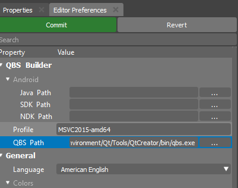
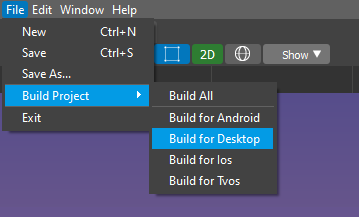
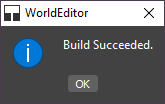

.. _doc_explore_builder:

Building Project
================

When your project is ready you probably would like to run it without Editor.
This section will help you to build your first project.

To build a release binary you will need a compiler:

* Visual Studio - on Windows
* clang - on Linux
* XCode - on MacOS

Also please check qbs build tool is reachable by the built environment.

::

	sdk/%version%/tools/qbs
	
Or it can be provided in the Editor Preferences:

If you are unable to find this tab please follow **Window->Editor Preferences**

Now we are ready to build your project.
All you need to launch a build process:

After this point a directory where the game will be placed.

In case all will go well you should see a message:

	
And your game will be copied into your build directory!

Builder Tool
------------

The Builder tool is a Continuous Integration (CI) friendly console tool.
It helps developers to create a game binary and pack required resources.

This tool can be found in the main bynary direcory near WorldBuilder.

::

    sdk/%version%/%platform%/x86_64/bin/Builder

To start the build process please use the following arguments:

::

    $ Builder -s project.forge -t target/directory -p platform

Where project.forge is a path to your project file, "target/directory" is the place where your game binaries will be placed.
The "platform" parameter defines the current platform for which your project will be built.