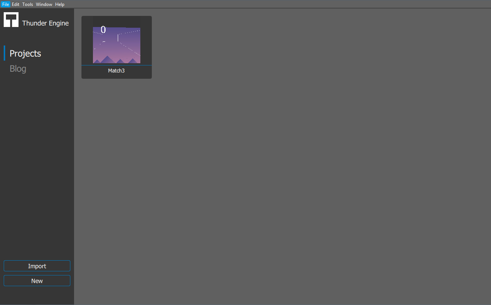
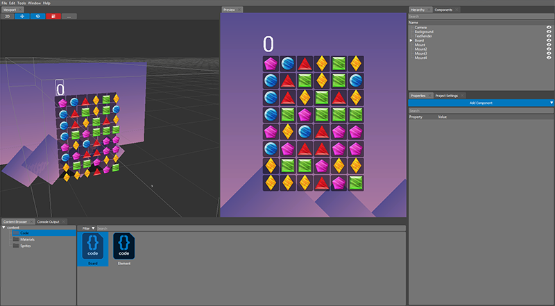

.. _doc_explore:

Explore Thunder Engine
==============================

Thunder Engine is an open-source multi-functional lightweight game engine for creating 2D and 3D games.
It provides a wide range of frameworks and tools. So developers can focus on the creation, and the Thunder Engine will do the routine.

The main ideology of project is to create the modular engine to give developers an ability to exclude modules which they are not using in their project to keep their projects lightweight.
API of Thunder Engine is also allowing to create own modules to use them in your games. Or create editor modules to help develop them.
For more details please refer to :doc:`architecture page </reference/architecture>`

.. _doc_explore_editor:

Developing with World Editor
----------------------------------------------

The World Editor tool is a main game development tool of Thunder Engine.
It can be found at the bin directory of your instalation path of Thunder Engine.
::

    sdk/2019.3/%platform%/x86_64/bin/WorldEditor
    
Where %platform% can be windows, linux or macos accordingly your operating system.

Startup screen allowing you to open your project, create a new or import existing also it contains additional functions which are under development for now.

The main window contains a flexible workspace which developers can adopt for their needs.

Here is several main zones:

	* Viewport - allows you to add and remove objects on scene, control position and rotation and do other basic operations.
	* Properties - created for fine tuning of all object properties (assigned material, texture, color and many more).
	* Content Browser - contains the list of assets which available for using in your project.
	* Components - contains the list of components which is currently available for placing on scene.
	* Hierarchy - represents the list of objects which placed on scene and relations between of them.
	
.. _doc_explore_builder:

Building with Builder tool
----------------------------------------------
The Builder tool is a Continuous Integration (CI) friendly console tool. It helps developers to create a game binary and pack required resources.

