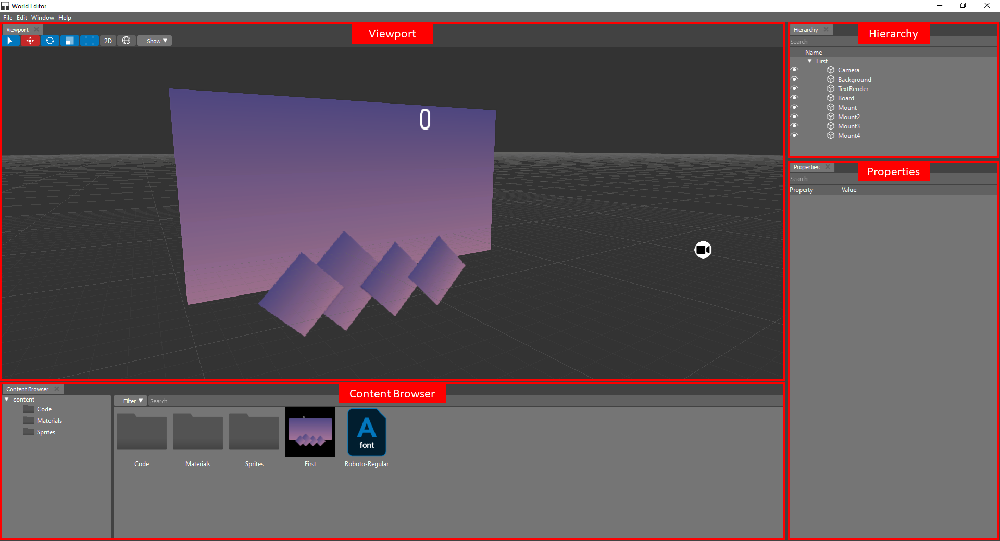

.. _doc_explore:

World Editor Overview
==============================

The World Editor tool is a main game development tool of Thunder Engine.
World Editor allows a team of designers and developers to share a projects across different development platforms with a common tool for design and development.

It can be found at the bin directory of your installation path of Thunder Engine.
::

    sdk/%version%/%platform%/x86_64/bin/WorldEditor

Where %version% is a version of the Thunder Engine for example 2020.4, %platform% can be windows, linux or macos accordingly your operating system.

.. _doc_explore_ui:

Welcome Screen
------------------------------

When you start World Editor, it opens to the **Welcome** screen, where you can:

    - Open recent projects
    - Create new projects
    - Import existing projects
    - Read news from the Thunder Engine project

.. image:: media/welcome.png
    :alt: Welcome screen
    :width: 800

Creating Projects
------------------------------

To create a new project do the following steps:
    - Click the **New** button
    

    
    - In the opened dialog select a directory where the project will be placed
    
Importing Projects
------------------------------
    - Click the **Import** button
    

    - In the opened dialog select a project file (**.forge**)

User Interface
------------------------------

Once you have created a new project or opened an existing one, you will be taken to the main screen.

The main screen contains a flexible workspace which developers can adopt for their needs.

The main screen contains several main zones:

    - **Viewport** - allows you to add and remove objects on scene, control position and rotation and do other basic operations
    - **Properties** - created for fine-tuning of all object properties (assigned material, texture, color and many more)
    - **Content Browser** - contains the list of assets which available for using in your project
    - **Hierarchy** - represents the list of objects which placed on scene and relations between of them
