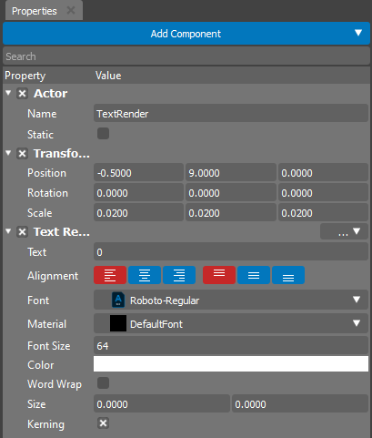
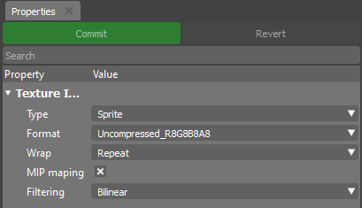

.. _doc_properties:

Properties
==============================

Properties is a tool created for fine-tuning of all object properties (assigned material, texture, color, and many more)

	
This editor contains a three main sections:

.. list-table::
   :widths: 10 90

   * - **Add Component**
     - Allows to add new Component to the selected Actor.
   * - **Search**
     - Can be used to filter out the required existent Component from the properties tree.
   * - **Prperties Tree**
     - A tree of all properties is available for editing.
	 
The tree of available properties creates automatically based on introspection of attached Components.
The user is able to add and remove Components from the Actor at any time:

- To add a new component please use the "Add Component" button.
- To remove component please use the "..." button near the component name.

Based on type the Property editor creates an appropriate widget for each property.

Asset Properties
----------------

Properties editor can also be used to change all import settings for the selected asset.

To activate this mode select any asset in the :ref:`doc_content`
	
In this mode additional buttons will appear:

.. list-table::
   :widths: 10 90

   * - **Commit**
     - Saves the import settings. Will lead to reimport of the asset.
   * - **Revert**
     - Rollback the import settings. All uncommitted changes will be loosed.
