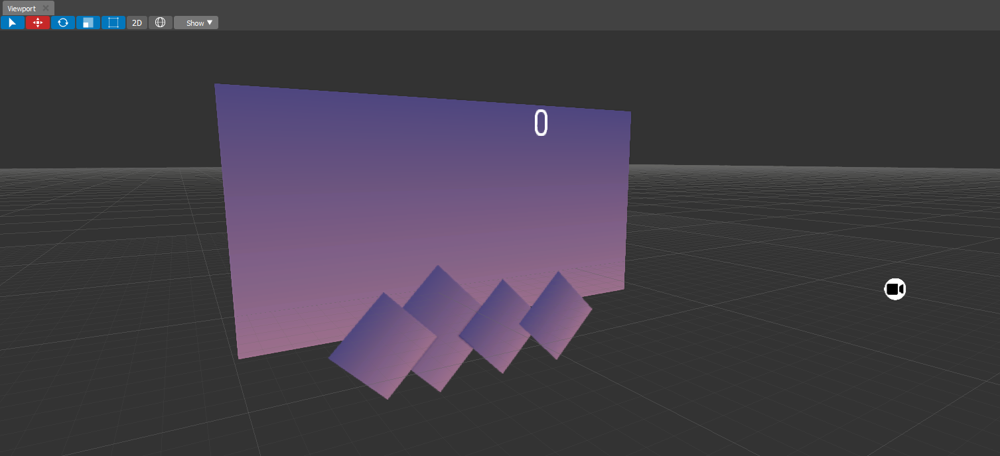

.. _doc_viewport:

Viewport
==============================

Viewport allows you to add and remove objects on scene, control their positions, rotations and do other basic operations.

Toolbar
-------

	
The toolbar contains a various controls to move, rotate and scale selected objects.

.. list-table::
   :widths: 10 90

   * - **Select**
     - Selects objects and nothing else. Can be used to prevent not intentional changes.
   * - **Move**
     - Select and Move. Allows moving selected objects by axes.
   * - **Rotate**
     - Select and Rotate. Allows rotate selected objects by axes.
   * - **Scale**
     - Select and Scale. Allows scale selected objects by axes.
   * - **Transform**
     - Select and Transform. Allows move and scale selected 2D objects.
   * - **2D**
     - Switches the Viewport between 2D and 3D modes.
   * - **Orientations**
     - Switches between Global and Local axes orientations:
	 
	    * **Global** - Align the transformation axes to world space.
	    * **Local** - Align the transformation axes to the selected objects’ space.
   * - **Show**
     - Switches the viewport position and shows various buffers used during rendering.

Navigation
----------

Hold :kbd:`RMB` and move the mouse in the direction you want to look.

.. list-table::
   :widths: 10 90

   * - :kbd:`W`/:kbd:`Up`
     - Accelerate forward.
   * - :kbd:`S`/:kbd:`Down`
     - Accelerate backwards.
   * - :kbd:`A`/:kbd:`Left`
     - Accelerate left.
   * - :kbd:`D`/:kbd:`Right`
     - Accelerate right.
   * - :kbd:`MMB`
     - Drag to pan the view.
       In this case the view can move laterally on its local axis at the moment you drag the mouse.
   * - :kbd:`WheelUp`
     - Zoom viewport camera In.
   * - :kbd:`WheelDown`
     - Zoom viewport camera Out.