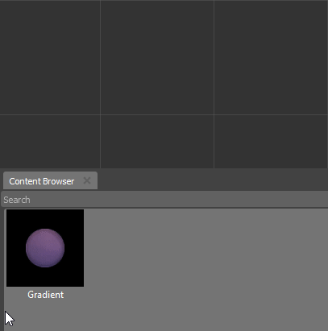
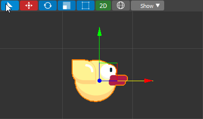
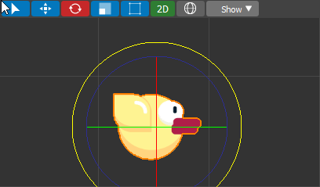
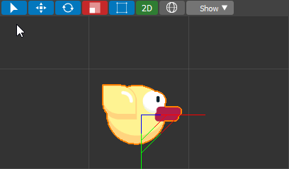

.. _doc_viewport:

Viewport
==============================

Viewport allows you to add and remove objects on scene, control their positions, rotations and do other basic operations.

.. image:: media/viewport.png
    :alt: Viewport

Creation/Selection Objects
----------------------------

The empty game doesn't look fun.
To make it visually appealing we need to add various game objects.
Thunder Engine supports many visual components like 2D sprites and 3D meshes.

Now let's create something!
There are a few methods how to placing objects on the scene.
The simplest way is to just drag and drop objects from a :ref:`doc_content`.

    
As you probably noticed the created object is automatically selected.
The selected object has an orange highlight around it.
A developer has the ability to change the color and thickness of a highlighter or completely disable it.
During development, you would need to select objects on the scene.
Just click by ``LBM`` on an object and it will be selected.

Toolbar
-------

.. image:: media/editor_tools.png
    :alt: Toolbar
    
The toolbar contains a various controls to move, rotate and scale selected objects.

.. list-table::
   :widths: 10 90

   * - **Select**
     - Selects objects and nothing else. Can be used to prevent not intentional changes.
   * - **Move**
     - Select and Move. Allows moving selected objects by axes.
   * - **Rotate**
     - Select and Rotate. Allows rotate selected objects by axes.
   * - **Scale**
     - Select and Scale. Allows scale selected objects by axes.
   * - **Transform**
     - Select and Transform. Allows move and scale selected 2D objects.
   * - **2D**
     - Switches the Viewport between 2D and 3D modes.
   * - **Orientations**
     - Switches between Global and Local axes orientations:
     
        * *Global* - Align the transformation axes to world space.
        * *Local* - Align the transformation axes to the selected objects’ space.
   * - **Show**
     - Switches the viewport position and shows various buffers used during rendering.
	 
Positioning Actors
------------------

After an object has been placed on the scene, we may want to move, rotate, or resize it.
Using Toolbar we can do this right in the Viewport.

    Moving

    Rotation

    Scaling

Key Scheme
----------

Hold :kbd:`RMB` and move the mouse in the direction you want to look.

.. list-table::
   :widths: 10 90

   * - ``W``/``Up``
     - Accelerate forward.
   * - ``S``/``Down``
     - Accelerate backwards.
   * - ``A``/``Left``
     - Accelerate left.
   * - ``D``/``Right``
     - Accelerate right.
   * - ``MMB``
     - Drag to pan the view.
       In this case the view can move laterally on its local axis at the moment you drag the mouse.
   * - ``WheelUp``
     - Zoom viewport camera In.
   * - ``WheelDown``
     - Zoom viewport camera Out.
   * - ``Del``
     - To delete selected object
