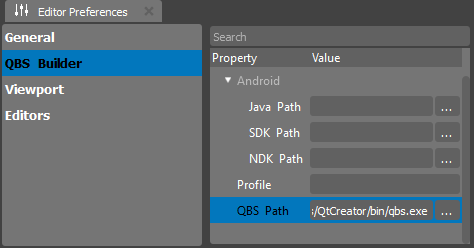

.. _doc_tools_builder:

Building Project
================

Once your project is ready, you may want to run it outside the editor for testing or distribution. This section provides guidance on building your project.

To build a release binary, you will need a compatible compiler for your platform:

- **Visual Studio** - on Windows
- **clang** - on Linux
- **XCode** - on MacOS

Ensure that the **Qbs Builder** is accessible by the build environment. You can check this by running the following command in your terminal or command prompt:

    sdk/%version%/tools/qbs

Alternatively, you can specify the Qbs path in the Editor Preferences:

If you cannot find this tab, please navigate to **Window -> Editor Preferences**.

Now, you are ready to build your project. Follow these steps:

1. Click on the **Build Project** button in the toolbar:

   .. image:: media/build_project.png
      :alt: Build Project

2. After initiating the build process, your game will be placed in a directory.

If the build process is successful, you should see a confirmation message:

   .. image:: media/success.png
      :alt: Success

Your game will be copied into the specified build directory.

Builder Tool
------------

The Builder tool is a console-friendly Continuous Integration (CI) tool that assists developers in creating a game binary and packaging required resources. Locate the Builder tool in the main binary directory near the World Builder executable:

::

  sdk/%version%/%platform%/x86_64/bin/Builder

To start the build process, use the following command-line arguments:

::

  $ Builder -s project.forge -t target/directory -p platform

Where:

- `project.forge` is the path to your project file.
- `target/directory` is the directory where your game binaries will be placed.
- `platform` specifies the target platform for which your project will be built.

This tool provides flexibility and automation for building your project from the command line, making it suitable for Continuous Integration workflows.

Explore these building options based on your preference and project requirements.