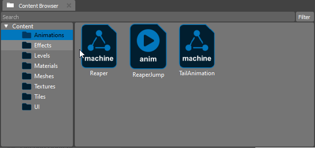
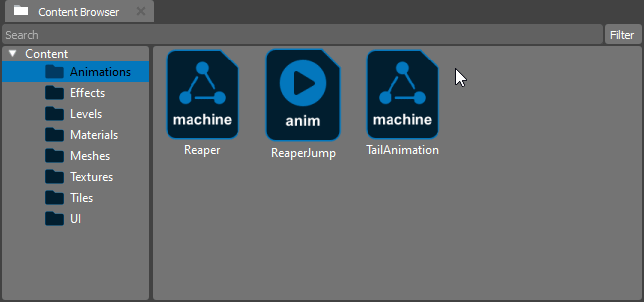

.. _doc_content:

Content Browser
===============

The Content Browser is a central component of your project, offering a convenient way to access and manage the assets available for use.

When you open the Content Browser, you'll find a list of all the assets that are at your disposal.
These assets may include images, audio files, documents, and other resources that you can utilize in your project.

Using the Content Browser, you can perform various tasks:

.. list-table::
   :widths: 10 90
   
   * - **Browse**
     - Navigate through the list of assets to find the one you need for your project.
   * - **Search**
     - Use the search functionality to quickly locate specific assets by name or keyword.
   * - **Preview**
	 - Get a visual preview assets directly within the Content Browser to ensure they are suitable for your project.
   * - **Import**
	 - Add new assets to your project by importing them through the Content Browser.
   * - **Organize**
	 - Create folders and organize your assets to keep your project well-structured.
   * - **Drag and Drop**
     - Easily drag and drop assets from the Content Browser into your project workspace.

Creating New Assets
-------------------

The Content Browser supports the creation of new assets directly from the context menu. Follow these steps:

1. Right-click in the Content Browser.
2. Select the type of asset you want to create (e.g., animation, material, behaviours).

This functionality simplifies the asset creation process, allowing you to generate new resources seamlessly within the Content Browser.

Importing Assets
----------------

Effortlessly expand your project's asset library by importing assets through the Content Browser. Follow these steps:

1. Open a context menu.
2. Click on the **Import New Asset...** option.
3. In the prompted dialog, browse and select the assets you want to import.

The Content Browser is designed to simplify asset management, helping you efficiently work with your project's resources.
Whether you're a designer, developer, or content creator, this tool is invaluable for enhancing your productivity.

Make the most of the Content Browser to streamline your workflow and ensure a seamless integration of assets into your project.

Opening Assets
--------------

Users can open assets for viewing and editing by double-clicking on the asset within the Content Browser.
This intuitive feature provides a quick way to inspect and modify assets directly from the Editor.

.. note::
   The World Editor comes equipped with a variety of embedded Editors, providing specialized tools for specific asset types.
   These Embedded Editors allow for a more in-depth and focused editing experience tailored to each asset category.

   Additionally, the extensibility of the World Editor is enhanced through the use of Plugins.
   Developers can create custom Plugins to add new features, tools, or support for specific asset types, expanding the capabilities of the World Editor to suit diverse project needs.

Filtering Content
-----------------

The Content Browser allows you to filter assets based on their types.
This feature enables you to focus on specific types of content, making it easier to manage and locate assets.
To filter content by type:

1. Navigate to the **Filter** menu in the Content Browser.
2. Choose the desired content type from the available options.

Now, you can efficiently narrow down your view to only the types of assets you currently need, enhancing your workflow and making content management even more streamlined.