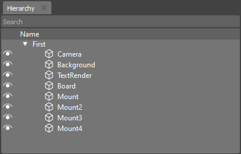

.. _doc_hierarchy:

Hierarchy
==============================

The Hierarchy widget is a crucial tool that provides an organized view of the objects placed within your scene and illustrates their relationships.

When you access the Hierarchy widget, you gain insight into the composition of your scene and how different objects within it are connected.

Key features and functionalities of the Hierarchy widget include:

.. list-table::
   :widths: 10 90

   * - **Object List**
     - The widget displays a list of all the objects present in your scene. These objects could be characters, props, or any other elements you've added to your project.
   * - **Hierarchy Representation**
	 - Objects are organized in a hierarchical manner, reflecting their parent-child relationships. This hierarchy aids in understanding how objects are positioned and nested within the scene.
   * - **Visibility Control**
     - You can toggle the visibility of objects in the scene directly from the Hierarchy widget. This feature is useful for simplifying your view when working with complex scenes.
   * - **Selection and Manipulation**
     - Easily select objects from the list to manipulate them within the scene. Change relationships with just dragging objects in widgets.

The Hierarchy widget is an indispensable tool for managing the complexity of your scene and ensuring that objects are correctly organized and interconnected. Whether you're designing a game, creating a 3D model, or working on a simulation, the Hierarchy widget streamlines your workflow and enhances your ability to navigate and manipulate your project.
