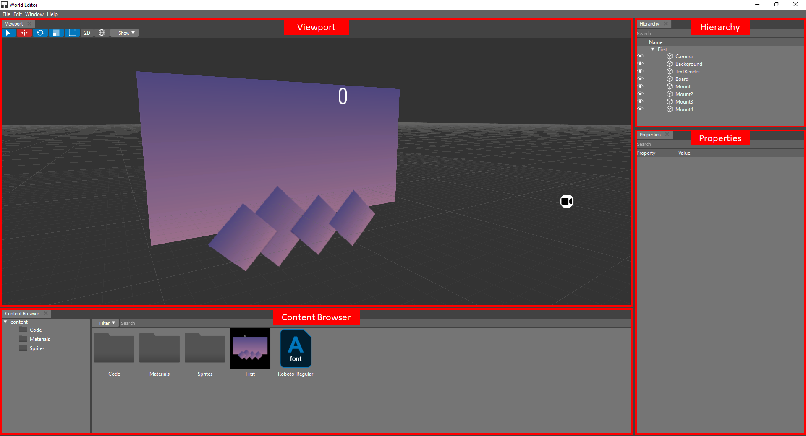

.. _doc_interface:

Workspace
==============================

When you create a new project or open an existing one, you will find yourself on the main screen.

The main screen provides a versatile workspace that developers can customize to suit their specific needs.
This workspace is the central hub where you'll perform various tasks and interact with your project's elements.

The main screen is divided into several key areas:

- **Viewport**: The viewport is the primary working area where you can view and manipulate project content. This is where you'll spend most of your time interacting with project assets.

- **Properties**: The properties panel, often located on the right side of the screen, displays detailed information and settings for selected project elements. You can use this panel to adjust properties and configurations.

- **Content**: This area houses the actual content of your project. It could be your code, design elements, documents, or any other project-specific data. You can organize and manage your content from this section.

- **Hierarchy**: The hierarchy panel provides an overview of the structure and organization of your project. It displays a tree-like representation of project elements, allowing you to navigate and access different parts of your project efficiently.

As you work within the main screen and navigate between these areas, you'll have the tools and resources you need to build, edit, and manage your project effectively. Feel free to explore the various zones to streamline your workflow and achieve your development goals.

Remember that the specific features and functionalities within each of these areas may vary depending on your project's nature and the software or platform you're using. Refer to the corresponding sections in this documentation for more detailed information on each area's functionality.

Explore the documentation sections below to learn more about the individual components of the user interface and how to make the most of them in your projects.

.. toctree::
   :maxdepth: 1
   :name: toc-interface
   
   viewport
   properties
   content
   hierarchy