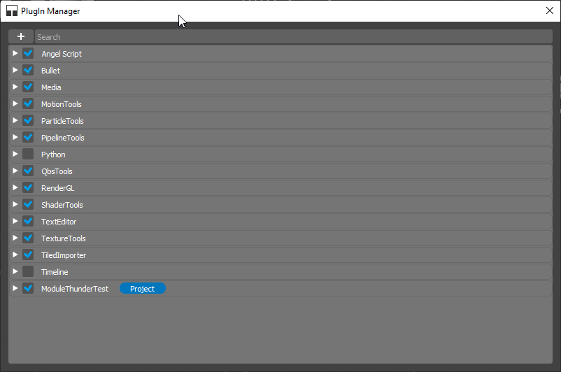
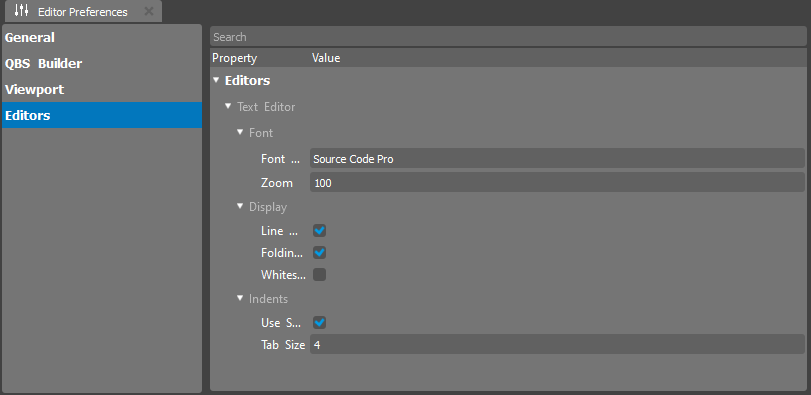

.. _doc_plugin_manager:

Plugin Managemer
===============================

Plugins in the editor provide a powerful mechanism to extend and enhance the functionality of the World Editor.
Whether you want to add custom tools, features, or support for specific asset types, plugins offer a flexible way to tailor the editor to your project's unique requirements.

Installing Plugins
------------------

To install a new plugin in the World Editor, follow these steps:

1. Navigate to the **Edit** menu.
2. Select **Plugin Manager**.
3. In the Plugin Manager, Hit **+** button.
4. Choose the plugin file or directory.

The World Editor will then load and integrate the plugin into its environment.

Managing Installed Plugins
--------------------------

Once plugins are installed, you can manage them through the Plugin Manager dialog.
To enable or disable a plugin:

1. Open Plugin Manager.
2. Locate the plugin in the list.
3. Toggle the switch next to the plugin to enable or disable it.
4. Hit "Restart Now" button to restart World Editor to apply changes.

Plugin Configuration
--------------------

Plugins often come with configuration options to customize their behavior.
Access the plugin configuration settings through the **Window > Editor Preferences** menu.

Here, you can fine-tune the plugin's settings to align with your project's needs.

Embedded Editors and Plugins
----------------------------

The World Editor supports Embedded Editors, which are specialized tools for specific asset types.
Some plugins may introduce new Embedded Editors to enhance the editing experience.

Plugin Development
------------------

For developers interested in creating their own plugins for the World Editor, a comprehensive plugin development guide is available.
This guide covers the necessary steps, best practices, and APIs to create custom plugins seamlessly integrated into the editor.

Conclusion
----------

Plugin management in the World Editor empowers users to extend the editor's capabilities according to project requirements. Whether you're installing pre-built plugins or developing your own, the World Editor's plugin system provides a versatile and efficient way to enhance your game development workflow.

Explore the diverse range of plugins available, experiment with customization options, and consider developing your plugins to unlock the full potential of the World Editor for your projects.

