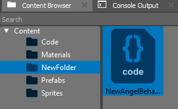

.. _doc_creating_scripts:

Creating and Using Scripts
==========================

Actor behavior is controlled by components attached to them.
In addition to the standard components provided by **Thunder Engine**, developers can add their own components implementing game logic and gameplay features.
These components allow triggering game events, responding to user actions, and modifying the properties of other components during gameplay.

At the moment, Thunder Engine supports C++ and AngelScript for implementing custom components.

Creating Scripts
----------------

Like many other assets, scripts are typically created directly in the engine editor.
Within the Content Browser window, simply right-click and select **Native Behaviour** for C++ code or **Angel Behaviour** for AngelScript code from the context menu.

A new script will be created in the **Content Browser** window in the folder you selected. You will also be prompted to choose a name for your new component.

It is good practice to give your component a meaningful name.
The name you choose will be used throughout scenes and prefabs, and changing it afterward can be challenging.

Script File Content
--------------------

When you double-click on your new script, it will open in a text editor.
By default, the Thunder Engine editor uses its built-in code editor.

The initial content will look something like this:

.. tabs::
    .. code-tab:: c++

        #include <nativebehaviour.h>

        class NewNative_Behaviour : public NativeBehaviour {
            A_REGISTER(NewNative_Behaviour, NativeBehaviour, Components)

        public:
            NewNative_Behaviour() {

            }

            ~NewNative_Behaviour() {

            }

            // Use this to initialize behaviour
            void start() {

            }

            // Will be called each frame. Use this to write your game logic
            void update() {

            }
        };

    .. code-tab:: java AngelScript

        class NewAngelBehaviour : Behaviour {
            // Use this to initialize behaviour
            void start() override {

            }

            // Will be called each frame. Use this to write your game logic
            void update() override {

            }
        };
        
The code written in your script will be executed by the engine's internal systems.
Now we are interested in only two functions. The **start** function is called every time an **Actor** containing our component is created in the scene.
It is usually used for initializing internal variables of our component.
The **update** function is called every frame and is responsible for handling events within the game, where you can write gameplay logic.
Of course, you can create your own functions to simplify working with the code.

Controlling Actors
---------------------

Now let's write something! Let's add the following code:

.. tabs::
    .. code-tab:: c++

        // Use this to initialize behaviour
        void start() {
            aDebug() << "Hello world!";
        }

    .. code-tab:: java AngelScript

        // Use this to initialize behaviour
        void start() override {
            debug("Hello world!");
        }

After saving your changes, the editor will detect them and start compiling your code.
Note that compiling C++ code requires a compiler installed for your system: **Visual Studio** for Windows, **GCC** or **Clang** for Linux, **Xcode** for MacOS.
No additional actions are required for AngelScript code.

After compiling the code, your component will appear in the drop-down menu of the **Add Component** button:

    
Let's add it to the selected Actor and start the simulation ``Ctrl+G``:

    
If everything was done correctly, you will see a message in the **Console Output** window:

