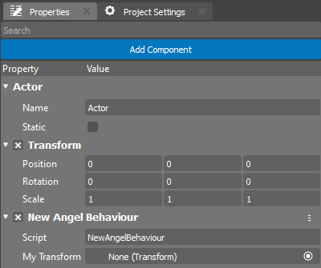
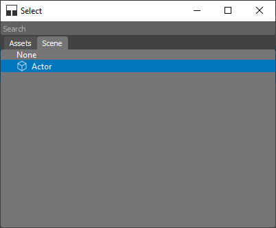

.. _doc_exporting_variables:

Variables and Property Editor
=============================

When you create a script, the editor automatically generates it from a special template.
The script will be inherited from a base class, **NativeBehaviour** for C++ and **AngelBehaviour** for AngelScript.

You can add your own variables and declare them as properties accessible for editing from the **Property** widget in the engine editor.

The code below declares the variable ``myVariable``.
When you add the component to any Actor in the Scene and select it, this property will be visible in the Properties editor as a field named "My Variable".
The default value "Some Text" will become the value in the property editing window.

.. tabs::
    .. code-tab:: c++

        #include <nativebehaviour.h>

        #include <log.h>

        class NewNative_Behaviour : public NativeBehaviour {
            A_REGISTER(NewNative_Behaviour, NativeBehaviour, Components)

            A_PROPERTIES(
                A_PROPERTY(string, myVariable, NewNative_Behaviour::myVariable, NewNative_Behaviour::setMyVariable)
            )

        private:
            string m_myVariable = "Some Text";

        public:
            // Use this to initialize behaviour
            void start() {
                aDebug() << "Current value of myVariable =" << m_myVariable.c_str();
            }

            string myVariable() const {
                return m_myVariable;
            }

            void setMyVariable(string variable) {
                m_myVariable = variable;
            }
        };

    .. code-tab:: java AngelScript

        class NewAngelBehaviour : Behaviour {
            string myVariable = "Some Text";

            // Use this to initialize behaviour
            void start() override {
                debug("Current value of myVariable=" + myVariable);
            }
        };

Each Actor to which you add your component will have its own value for this property.
Note that property declaration in C++ code differs significantly. For more information, refer to the :doc:`native_introspection` section.

.. image:: media/my_variable.png
    :alt: My Variable
    :width: 400

For user convenience, the Property Editor changes the display of your property name by adding spaces between lowercase and uppercase letters. However, in your code, you still need to use the variable name you specified.

Object Reference Properties
---------------------------

In addition to basic property types such as string, integer, bool, and others, developers may need properties that reference other objects in the Scene (Transforms, Lights, Actors) or assets (Textures, Meshes, Materials). The code snippet below demonstrates how to achieve this:

.. tabs::
    .. code-tab:: c++

        #include <nativebehaviour.h>

        class NewNative_Behaviour : public NativeBehaviour {
            A_REGISTER(NewNative_Behaviour, NativeBehaviour, Components)

            A_PROPERTIES(
                A_PROPERTYEX(Transform *, myTransform, NewNative_Behaviour::myTransform, NewNative_Behaviour::setMyTransform, "editor=Component")
            )

        private:
            Transform *m_myTransform = nullptr;

        public:
            Transform *myTransform() const {
                return m_myTransform;
            }

            void setMyTransform(Transform *transform) {
                m_myTransform = transform;
            }
        };

    .. code-tab:: java AngelScript

        class NewAngelBehaviour : Behaviour {
            Transform @myTransform = null;

            // Use this to initialize behaviour
            void start() override {

            }
        };

Note that in C++ code, an extended property is added.
In this property, you can specify additional metadata as a string.
This is necessary for the editor to understand the type of property it is working with.
In this example, we indicate that a special editor type ``Component`` should be created.
There are other editors available:
    * Color
    * Component
    * Asset
    * Alignment
    * Axes

In the Properties window, it will look like this:

Clicking the button in the property editor will bring up a special window that allows you to select the desired Object.

