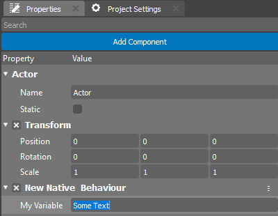

.. _doc_exporting_variables:

Variables and Property Editor
=============================

Когда вы создаете скрипт, Редактор он автоматически создает его из специального шаблона.
Скрипт будет унаследован от безового класса, для C++ **NativeBehaviour** а для AngelScript **AngelBehaviour**.

Вы можете добавлять ваши переменые и объявлять их свойствами доступными для редактирования из виджета **Property** в Редакторе движка.

Приведенный ниже код объявляет переменную ``myVariable``.
Когда в добавите компанент к любому Актору на Cцене и выберете его, это свойство будет видимо в редакторе Properties как поле с именем "My Variable".
Значение по умолчанию "Some Text" станет значением в окне редактирования свойства.

.. tabs::
    .. code-tab:: c++

        #include <nativebehaviour.h>

        #include <log.h>

        class NewNative_Behaviour : public NativeBehaviour {
            A_REGISTER(NewNative_Behaviour, NativeBehaviour, Components)

            A_PROPERTIES(
                A_PROPERTY(string, myVariable, NewNative_Behaviour::myVariable, NewNative_Behaviour::setMyVariable)
            )

        private:
            string m_myVariable = "Some Text";

        public:
            // Use this to initialize behaviour
            void start() {
                aDebug() << "Current value of myVariable =" << m_myVariable.c_str();
            }

            string myVariable() const {
                return m_myVariable;
            }

            void setMyVariable(string variable) {
                m_myVariable = variable;
            }
        };

    .. code-tab:: java AngelScript

        class NewAngelBehaviour : Behaviour {
            string myVariable = "Some Text";

            // Use this to initialize behaviour
            void start() override {
                debug("Current value of myVariable=" + myVariable);
            }

        };

Каждый Актор к которому вы добавите ваш компанент будет содержать свое значение данного свойства.
Обратите внимание что декларирование свойств в коде написаном на С++ существенно отличается.
Более подробно об этом можно прочитать в :doc:`native_introspection`:

	
Для удобства пользователя Редактор Свойств меняет отображение имени вашего свойства добавляя пробел в между буквами нижнего и верхнего регистра.
В коде вам все еще необходимо использовать имя переменной которую вы указали.
