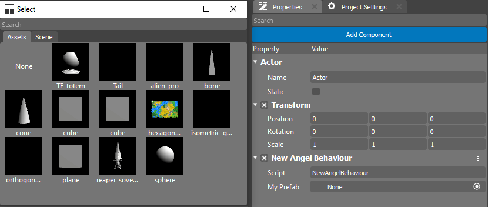
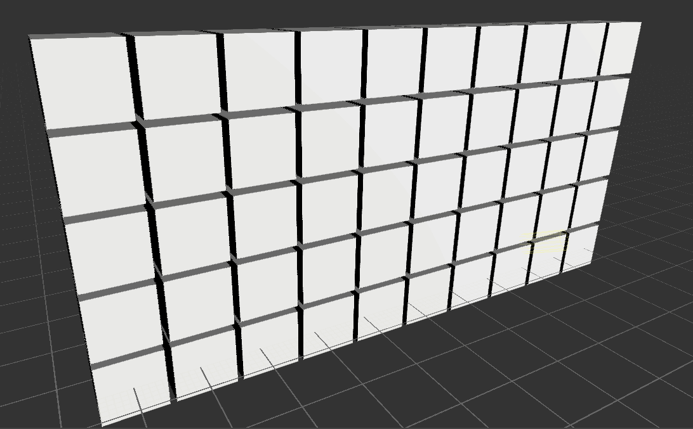

.. _doc_instantiating_prfabs:

Instantiating Prefabs
=====================

Prefabs can be very useful if you want to create complex Actors during gameplay.
Instantiating game objects from Prefabs instead of creating game objects from scratch during runtime has several advantages:
    * Create a complex object with just one line instead of describing all components and their properties in detail in code.
    * Modify the Prefab in the Editor and get updates without needing to update the code.
    * Easily replace one Prefab with another without changing the code.

Let's Get Started
-----------------

To instantiate a Prefab, you need to have a reference to it in your code.
You can use a public variable to hold this reference.
This variable will appear in the Properties editor, allowing you to assign the desired Prefab from the editor:

.. tabs::
    .. code-tab:: c++

        #include <nativebehaviour.h>

        class NewNative_Behaviour : public NativeBehaviour {
            A_REGISTER(NewNative_Behaviour, NativeBehaviour, Components)

            A_PROPERTIES(
                A_PROPERTYEX(Prefab *, myPrefab, NewNative_Behaviour::myPrefab, NewNative_Behaviour::setMyPrefab, "editor=Asset")
            )

        private:
            Prefab *m_myPrefab = nullptr;

        public:
            void start() {
                Instantiate(m_myPrefab, Vector3(0, 0, 0), Quaternion());
            }
        
            Prefab *myPrefab() const {
                return m_myPrefab;
            }

            void setMyPrefab(Prefab *prefab) {
                m_myPrefab = prefab;
            }
        };

    .. code-tab:: java AngelScript

        class NewAngelBehaviour : Behaviour {
            // Reference to the Prefab asset.
            Prefab @myPrefab = null;

            // Use this to initialize behaviour
            void start() override {

                // Creates an Actor at position (0, 0, 0) and no rotation.
                instantiate(myPrefab, Vector3(0, 0, 0), Quaternion());
            }
        };

Now, add this script to any Actor in the scene and assign a cube Prefab.

    
Once you've assigned the Prefab, you can press ``Ctrl+G`` to start the simulation.

If you've done everything correctly, a cube will appear in your scene.

.. image:: media/instance_of_cube.png
    :alt: Instantiated Cube
    :width: 550
    
Creating Structures
------------------

You can create many copies of a Prefab almost instantly.
Using code to create structures is called **Procedural Generation**.
Create a new script and name it **Wall**.
The code below describes creating a wall from blocks.

.. tabs::
    .. code-tab:: c++

        #include <nativebehaviour.h>

        class Wall : public NativeBehaviour {
            A_REGISTER(NewNative_Behaviour, NativeBehaviour, Components)

            A_PROPERTIES(
                A_PROPERTYEX(Prefab *, blockPrefab, NewNative_Behaviour::blockPrefab, NewNative_Behaviour::setBlockPrefab, "editor=Asset")
                A_PROPERTY(int, width, NewNative_Behaviour::width, NewNative_Behaviour::setWidth),
                A_PROPERTY(int, height, NewNative_Behaviour::height, NewNative_Behaviour::setHeight)
            )

        private:
            Prefab *m_blockPrefab = nullptr;
            
            int m_width = 10;
            int m_height = 5;

        public:
            void start() {
                for(int y=0; y<height; ++y) {
                    for(int x=0; x<width; ++x) {
                        Instantiate(m_myPrefab, Vector3(x + x * 0.1, y + y * 0.1, 0), Quaternion());
                    }
                }
            }
        
            Prefab *blockPrefab() const {
                return m_blockPrefab;
            }

            void setBlockPrefab(Prefab *prefab) {
                m_blockPrefab = prefab;
            }
            
            int width() const {
                return m_width;
            }

            void setWidth(int width) {
                m_width = width;
            }
            
            int height() const {
                return m_height;
            }

            void setHeight(int height) {
                m_height = height;
            }
        };

    .. code-tab:: java AngelScript

        class Wall : Behaviour {
            // Reference to the Prefab asset.
            Prefab @blockPrefab = null;
            
            int width = 10;
            int height = 5;

            void start() override {
                for(int y=0; y<height; ++y) {
                    for(int x=0; x<width; ++x) {
                        instantiate(blockPrefab, Vector3(x + x * 0.1, y + y * 0.1, 0), Quaternion());
                    }
                }
            }
        };

Once you've set up your Actor and run the simulation, you'll see your wall on the screen:

White Walkers shall not pass! The Seven Kingdoms can sleep peacefully now.
