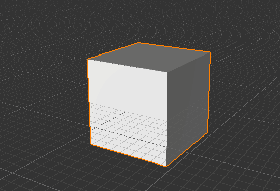

.. _doc_instantiating_prfabs:

Instantiating Prefabs
=====================

Prefabs могут оказаться очень полездными если вы хотите создать сложные Акторы во время игрового процесса.
Создание игровых объектов из Префабов вместо создания игровых объектов с нуля во время игры имеет множество приемуществ:
    * Создать сложный объект всего одной строкой вместо подробного описания всех компанент и их свойств в коде.
    * Модифицировать Префаб в Редакторе и получить обновления без необходимости обновлять код.
    * Всегда можно легко заменить Префаб на другой без внесения изменений в код.
    
Давай приступим
---------------

Для того что-бы инстанцировать Префаб вам необходимо иметь ссылку на него в вашем коде.
Вы можете использовать публичную переменную которая будет содержать эту ссылку.
Эта переменная появится в Properties editor и вы сможете назначить нужный префаб из редактора:

.. tabs::
    .. code-tab:: c++

        #include <nativebehaviour.h>

        class NewNative_Behaviour : public NativeBehaviour {
            A_REGISTER(NewNative_Behaviour, NativeBehaviour, Components)

            A_PROPERTIES(
                A_PROPERTYEX(Prefab *, myPrefab, NewNative_Behaviour::myPrefab, NewNative_Behaviour::setMyPrefab, "editor=Asset")
            )

        private:
            Prefab *m_myPrefab = nullptr;

        public:
            void start() {
                Instantiate(m_myPrefab, Vector3(0, 0, 0), Quaternion());
            }
        
            Prefab *myPrefab() const {
                return m_myPrefab;
            }

            void setMyPrefab(Prefab *prefab) {
                m_myPrefab = prefab;
            }
        };

    .. code-tab:: java AngelScript

        class NewAngelBehaviour : Behaviour {
            // Reference to the Prefab asset.
            Prefab @myPrefab = null;

            // Use this to initialize behaviour
            void start() override {

                // Creates an Actor at position (0, 0, 0) and no rotation.
                instantiate(myPrefab, Vector3(0, 0, 0), Quaternion());
            }
        };

Теперь добавим этот скрипт на любой Actor на сцене и назначим Префаб куб.

.. image:: media/my_prefab.png
    :alt: My Prefab
    :width: 800
    
После того как мы назначили префаб можно нажать ``Ctrl+G`` что бы запустить симуляцию.

Если вы все сделали правильно на вашей сцене появится куб.

    
Создание структуры
------------------

Вы можете создать много копий Префаба практически мгновенно.
Использовние кода для создание структур называется **Процедурной Генерацией**.
Создайте новый скрипт и назовите его **Wall**.
Код приведеный внизу описывает создание стены из блоков.

.. tabs::
    .. code-tab:: c++

        #include <nativebehaviour.h>

        class Wall : public NativeBehaviour {
            A_REGISTER(NewNative_Behaviour, NativeBehaviour, Components)

            A_PROPERTIES(
                A_PROPERTYEX(Prefab *, blockPrefab, NewNative_Behaviour::blockPrefab, NewNative_Behaviour::setBlockPrefab, "editor=Asset")
                A_PROPERTY(int, width, NewNative_Behaviour::width, NewNative_Behaviour::setWidth),
                A_PROPERTY(int, height, NewNative_Behaviour::height, NewNative_Behaviour::setHeight)
            )

        private:
            Prefab *m_blockPrefab = nullptr;
            
            int m_width = 10;
            int m_height = 5;

        public:
            void start() {
                for(int y=0; y<height; ++y) {
                    for(int x=0; x<width; ++x) {
                        Instantiate(m_myPrefab, Vector3(x + x * 0.1, y + y * 0.1, 0), Quaternion());
                    }
                }
            }
        
            Prefab *blockPrefab() const {
                return m_blockPrefab;
            }

            void setBlockPrefab(Prefab *prefab) {
                m_blockPrefab = prefab;
            }
            
            int width() const {
                return m_width;
            }

            void setWidth(int width) {
                m_width = width;
            }
            
            int height() const {
                return m_height;
            }

            void setHeight(int height) {
                m_height = height;
            }
        };

    .. code-tab:: java AngelScript

        class Wall : Behaviour {
            // Reference to the Prefab asset.
            Prefab @blockPrefab = null;
            
            int width = 10;
            int height = 5;

            void start() override {
                for(int y=0; y<height; ++y) {
                    for(int x=0; x<width; ++x) {
                        instantiate(blockPrefab, Vector3(x + x * 0.1, y + y * 0.1, 0), Quaternion());
                    }
                }
            }
        };

Когда вы закончите настройку вашего Актора и запустите симуляцию, вы увидите вашу стену на экране:

	
Белые Ходоки не пройдут! 7 королевств могут спать теперь спокойно.