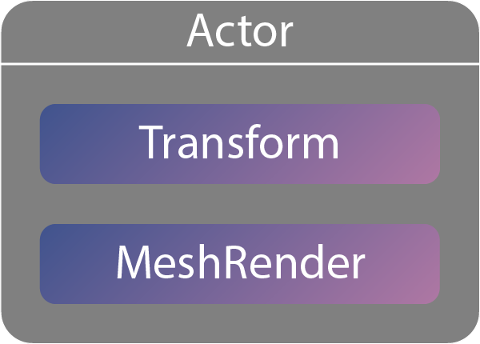

.. _doc_scripting_overview:

Overview
========

Thunder Engine was designed to be a modular.
This means developers are enable or disable a various modules.
Also developers can create their own modules for their needs.
In the Editor your custom module will be created automatically when you will create any Native Behaviour.
The Editor will handle all required registration for your Native Behaviour automatically.
The conceps below are common across programming modules.

Actor
-----

This simple object is a key ring for all related Components.

Actors is a main objects on the scene.
They can be united into hierarchies.

.. image:: media/hierarhy.png
    :alt: Actor Scheme
    :width: 200

Components
----------

Components is a blood of any game in Thunder Engine.
Components contain information how your game Actors look like or how they interact with other Actors.
This information called Properties and it can be modified in Editor or right from the game code.
Using Native version of API developers are able to create any type of Components.
But at the same time using Scriptable API only Behaviour type of components are available.

The example of custom component:

.. tabs::
    .. code-tab:: c++

        #include <nativebehaviour.h>

        class MyComponent : public NativeBehaviour {
            A_REGISTER(MyComponent, NativeBehaviour, Components)

            A_NOPROPERTIES()
            A_NOMETHODS()

        public:
            // Use this to initialize behaviour
            void start() {

            }
            
            // Will be called each frame. Use this to write your game logic
            void update() {
                
            }

        };

    .. code-tab:: java AngelScript

        class Tube : Behaviour {
            // Use this to initialize behaviour
            void start() override {

            }

            // Will be called each frame. Use this to write your game logic
            void update() override {

            }

        };
    
Property
--------

A variable that can be changed from Editor or in game.

The *Position*, *Rotation* and *Scale* are properties of the Transform component.

For a specific programming language please refer:

* :ref:`doc_native_properties`
   
Signals and Slots
-----------------

When developing gameplay, sometimes it becomes necessary for one object to communicate something to another object.
For example, a player has been killed and the "Game Over" window needs to be displayed.
There are at least two ways to do this.
To call window directly or just to send a signal.
The listener will catch it and will react on it.

For a specific programming language please refer:

* :ref:`doc_native_signals`

Resource
--------

Any data set that can be loaded from the file system.
Some Components like MeshRender uses Resources.
An asstes in the :ref:`doc_content` a good example of the resources.
Any Resources must be controlled by the Resource System.
This system controls the life cicle of the resource.
Loads them on demand and unloads when it not needed anymore.
