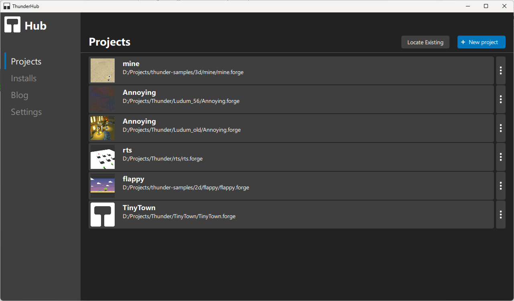
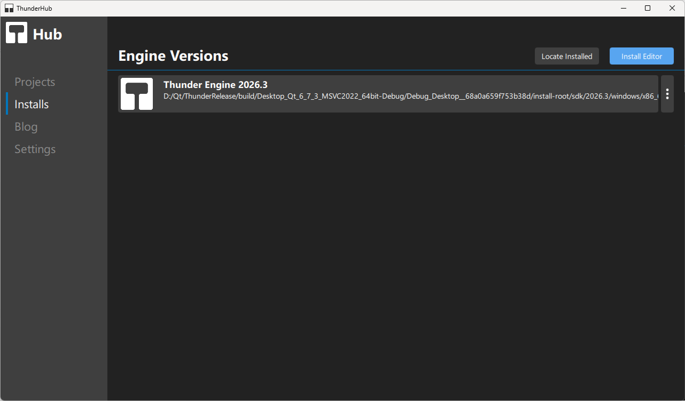
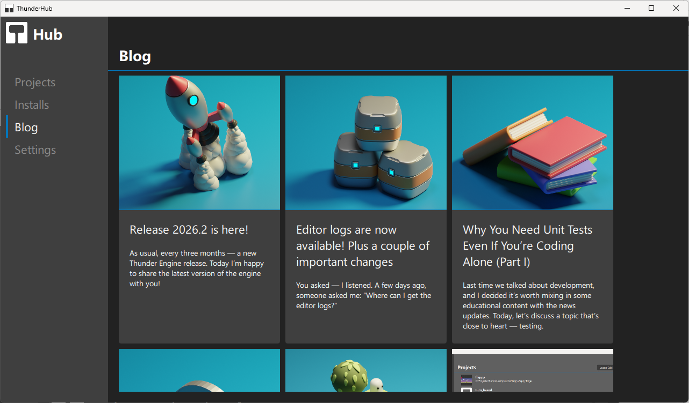

Thunder Hub
===========

.. _doc_basics_thunder_hub:

Overview
--------

Thunder Hub is a companion application for Thunder Engine that centralizes management of projects and engine installations.
Use Hub to create or locate projects, manage installed engine versions, and follow news and releases.

Projects
--------

Key actions:

- **Locate Existing** — add an existing project directory to Hub.
- **New project** — create a new project from templates (if available).
- Project list — double-click to open in the configured editor or use the context menu (three dots) for more actions.

Installs / Engine Versions
--------------------------

Hub shows detected engine installations and lets you register local builds or install editors.
Use **Install Editor** to add a new editor distribution, or **Locate Installed** to point Hub to an existing SDK.

Blog / News
-----------

The Blog tab surfaces project news and release notes.
Check it to discover new releases and important updates.

Tips & Troubleshooting
----------------------

- If Hub cannot find an SDK with World Editor, use **Locate Installed** and point to the WorldEditor binary.
- Hub stores metadata about projects and installs in a local configuration; back it up if you need to migrate settings.
