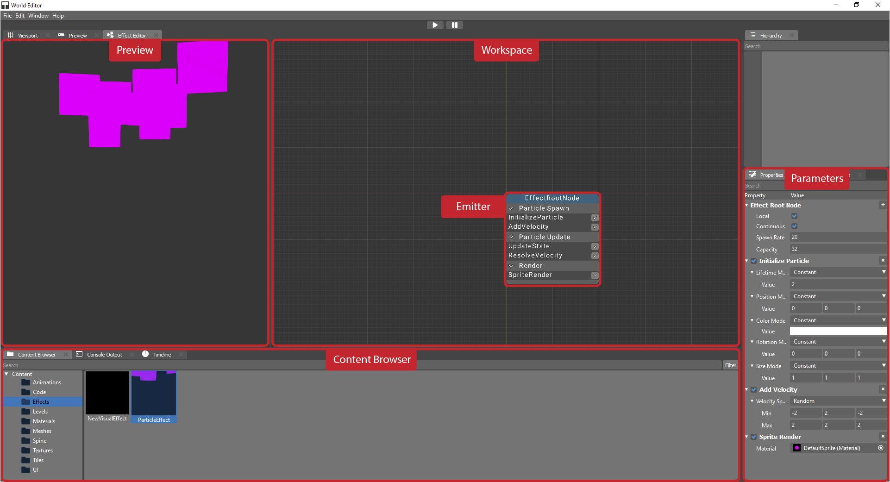
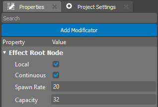

.. _doc_vfx_editor:

User Documentation for the VFX Editor in the Game Engine
========================================================

Introduction
------------

The VFX editor is a tool designed for creating and editing visual effects (VFX) in the game engine. Using this editor, you can create particle effects, lighting, shadows, animations, and other graphical elements that enhance the visual experience of the game.

This documentation is intended for users who want to learn how to use the VFX editor to create, configure, and optimize visual effects in their games.

1. Getting Started with the VFX Editor
--------------------------------------

### 1.1 Editor Interface

The editor consists of several key areas:

- **Workspace**: The area where VFX are visualized and edited, allowing you to configure and preview the effect in real time.

- **Parameter Editor**: A panel located next to the workspace, where you can adjust the parameters of each particle modifier. Here, you can configure properties such as particle emission, trajectory, size, speed, and lifetime.

- **Preview Window**: The area where you can preview the effect in real time. The Preview Window updates as you change the parameters, allowing you to immediately see the results.

In the editor, effects are represented as a cascade of particle modifiers, which allow you to fine-tune every aspect of the effect.

2. Creating a New Effect
------------------------

### 2.1 Creating a Particle Effect

1. Go to the **Content Browser**.

2. Right-click and select **Visual Effect** from the context menu.

	
3. Confirm the creation. The new effect will appear in the **Content Browser** and will be available for further editing.

### 2.2 Cascade of Particle Modifiers

An effect consists of a series of modifiers that control different aspects of particle behavior. The cascade of modifiers allows you to configure:
- **Particle Emission**: Set the quantity and frequency of particle generation.

- **Motion Trajectory**: Define the direction and speed of the particles' movement.

- **Particle Lifetime**: Specify how long each particle lasts.

- **Particle Size and Textures**: Configure the appearance, including textures, transparency and other visual properties.

Each modifier can be adjusted using a settings available in the **Parameter Editor**.

3. Adding Modifiers to the Cascade
----------------------------------

Modifiers in the cascade control various aspects of particle behavior and their interaction with the environment. Properly configuring the modifiers is essential for achieving the desired visual effect.

1. **Adding a Modifier**

   To add a new modifier, click on "+" button in **Properties** and seclect one of the available modifier types
   

	
   Some of available modificators:
   - **Add Velocity** – to modify the particle speed.
   - **Rotation Rate** – to control the particle rotation angle.
   - **Color Scale** – to smoothly change the color of the particles from birth to death.
   - **Size Scale** – to modify the size of the particles over time.

2. **Configuring Modifier Parameters**  
   After adding a modifier, you can adjust its parameters in the **Parameter Editor**. Depending on the modifier type, different settings will be available. For example:
   - For the **Velocity** modifier, you can set the speed and direction.
   - For **Color Scale**, you can select the initial and final particle colors, as well as the duration of the color change.

3. **Previewing Changes**  
   After adding and configuring the modifiers, you can immediately see the result in the **Preview** window. This will help you assess the impact of each change in real-time and fine-tune the parameters to achieve the desired outcome.

4. **Removing a Modifier**  
   To remove a modifier, click on "X" button in **Properties** window. Removing the modifier will not affect other elements of the effect.
   

By following these steps, you can efficiently add and configure modifiers in the cascade to create complex and realistic visual effects.

4. Configuring Materials in the Cascade of Modifiers
----------------------------------------------------

Materials control the appearance of the objects involved in the effect. They are assigned in the **Render** section of the cascade of modifiers. In the editor, you can configure:
- **Materials for 3D objects**, if they are used in the effect.
- **Special effects**, such as fire, smoke, or water simulations.